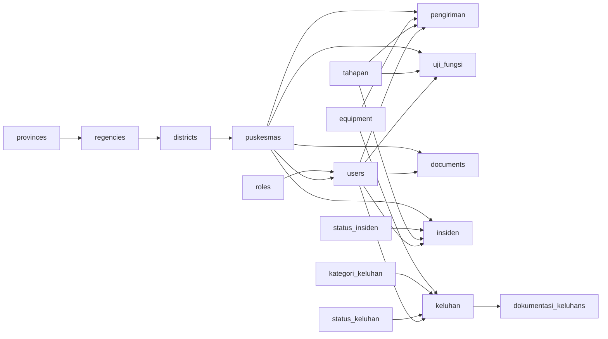

# Database Schema Dependencies

Dokumen ini merangkum urutan tabel berdasarkan hubungan foreign key untuk memudahkan: restore manual, re-seeding parsial, dan analisis dampak.

## Topological Order (CREATE Sequence)
1. roles
2. provinces
3. regencies (FK → provinces)
4. districts (FK → regencies)
5. equipment
6. kategori_keluhan
7. status_keluhan
8. status_insiden
9. tahapan
10. puskesmas (FK → districts)
11. users (FK → roles, puskesmas)
12. pengiriman (FK → puskesmas, equipment, tahapan, users)
13. uji_fungsi (FK → puskesmas, users)
14. documents (FK → puskesmas, users)
15. keluhan (FK → equipment, kategori_keluhan, status_keluhan, users)
16. dokumentasi_keluhans (FK → keluhan)
17. insiden (FK → puskesmas, tahapan, status_insiden, users)
18. failed_jobs
19. migrations
20. password_resets

Tabel 18–20 independen: bisa diletakkan di awal atau akhir.

## DROP Sequence (Safe Reverse)
1. insiden
2. dokumentasi_keluhans
3. keluhan
4. documents
5. uji_fungsi
6. pengiriman
7. users
8. puskesmas
9. tahapan
10. status_insiden
11. status_keluhan
12. kategori_keluhan
13. equipment
14. districts
15. regencies
16. provinces
17. roles
18. password_resets
19. migrations
20. failed_jobs

## Mermaid Graph

## Ringkasan Dependensi
| Tabel | Bergantung Pada | Direferensikan Oleh |
|-------|-----------------|---------------------|
| roles | - | users |
| provinces | - | regencies |
| regencies | provinces | districts |
| districts | regencies | puskesmas |
| puskesmas | districts | users, pengiriman, uji_fungsi, documents, insiden |
| equipment | - | keluhan, pengiriman |
| kategori_keluhan | - | keluhan |
| status_keluhan | - | keluhan |
| status_insiden | - | insiden |
| tahapan | - | pengiriman, insiden, uji_fungsi |
| users | roles, puskesmas | pengiriman, uji_fungsi, documents, keluhan, insiden |
| pengiriman | puskesmas, equipment, tahapan, users | - |
| uji_fungsi | puskesmas, users | - |
| documents | puskesmas, users | - |
| keluhan | equipment, kategori_keluhan, status_keluhan, users | dokumentasi_keluhans |
| dokumentasi_keluhans | keluhan | - |
| insiden | puskesmas, tahapan, status_insiden, users | - |
| failed_jobs | - | - |
| migrations | - | - |
| password_resets | - | - |

## Praktik Restore
- Bulk load cepat: jalankan `SET FOREIGN_KEY_CHECKS=0;` sebelum create + insert massal, lalu aktifkan lagi.
- Strict referential: isi lookup (roles, provinces, regencies, districts, equipment, kategori_keluhan, status_*, tahapan) dulu sebelum memasukkan data child.

## Partial Domain Restore
- Logistik Pengiriman: roles, provinces → regencies → districts → puskesmas → equipment, tahapan → users → pengiriman (+ uji_fungsi, documents opsional).
- Keluhan: equipment, kategori_keluhan, status_keluhan, users (dan rantai lokasi jika butuh user puskesmas) → keluhan → dokumentasi_keluhans.
- Insiden: puskesmas, tahapan, status_insiden, users → insiden.

## Catatan
Tidak ditemukan siklus FK; semua relasi satu arah (DAG). Dokumentasi ini bisa diperbarui jika ada migrasi baru menambah FK.
